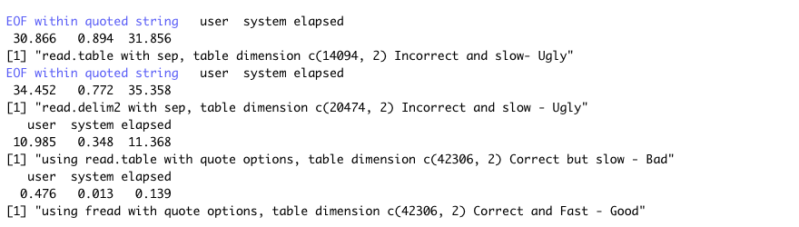
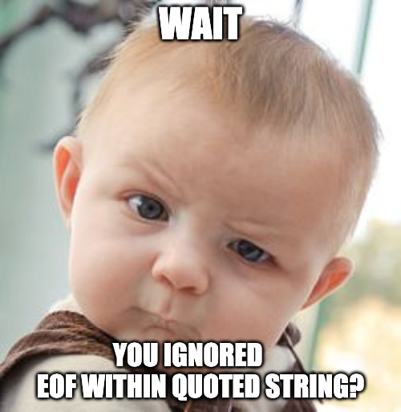

```{r setup, include=FALSE, echo=FALSE}
knitr::opts_chunk$set(echo = TRUE)
library(ggplot2)
library(doParallel)
library(foreach)
library(reshape2)
library(dplyr)
num_cores <- parallel::detectCores() 
registerDoParallel(num_cores)
```

## Prologue

Once upon a time, it was adequate for researchers, statisticians, analysts and scientists to

a. pull up the Rstudio, 
b. `read.csv()` csv file or `read.table()` other formats, 
c. for loop into rows and columns of data and 
d. apply statistical analysis and draw inference from observations/experiments. 

Since then, the universe has been expanding and so the programming languages and methods. With great power have come great challenges. The good old methodologies are getting really ugly pretty fast. The lovely task of selecting the best tools to solve those problems are becoming a challenge. It has become more critical to understand the nature of the problem, the quality/size of datasets and the philosophy behind analytical methods. As we are dwelling with all those challenges, sharing best practices could change our programming habbits toward a better life. Well, let's start the show:


## Good, bad, ugly data import 

Following the cinematic schema of this blog, I would like to use movie data to illustrate how parallelization can make our lives less dramatic. The dataset I am using here is downloaded from [CMU Movie Summary Corpus](http://www.cs.cmu.edu/~ark/personas/data/MovieSummaries.tar.gz). There are 42,306 rows of plot summaries available in the txt file. For detailed information about the dataset please visit the page. First, let's go ahead and import the file. Doing a quick search returns handful R reading packages, but why? Let's try some of those:

```{r movies, eval=FALSE}
#### Read data using typical tab-seperated read.table with default inputs 
system.time(plot_summary <- read.table('../data/plot_summaries.txt', sep = '\t'))
print(paste('read.table with sep, table dimension', 
            list(dim(plot_summary)), 
            'Incorrect and slow- Ugly'))
#### Read data using tab-seperated read.delim2 function with default inputs 
system.time(plot_summary <- read.delim2('../data/plot_summaries.txt', sep = '\t'))
print(paste('read.delim2 with sep, table dimension', 
            list(dim(plot_summary)), 
            'Incorrect and slow - Ugly'))
#### Read data using tab-seperated read.delim2 function with no quote requirements
system.time(plot_summary <- read.table('../data/plot_summaries.txt', sep = '\t', quote = ''))
print(paste('using read.table with quote options, table dimension', 
            list(dim(plot_summary)), 
            'Correct but slow - Bad'))
#### Read data using fread with no quote requirements 
system.time(plot_summary <- data.table::fread('../data/plot_summaries.txt', header = FALSE, quote = ''))
print(paste('using fread with quote options, table dimension', 
            list(dim(plot_summary)), 
            'Correct and Fast - Good'))
```


As you can see above, there are Good, bad and ugly ways to read in data especially when you are dealing with large and dirty data. **I should confess that the concept of good, bad, and ugly here is dependant on dataset size and type, looking into advantages and disadvantages of each method can be really eye-opening**. The first two reading functions are throwing warnings and the number of rows do not match with the real data!! First thing first: `DO NOT ignore EOF within quoted string` warning as it might result in wrong analytics down in your code. If you would like to find out why, read the paragraph below, otherwise feel free to skip that paragraph.



What does 'EOF within quoted string' statement tell us and why are we seeing three different row numbers on the same dataset above? they are all due to quotations!! (either single or double quotes). In a perfect world, you would close any quote you "opened" but we are not leaving in a perfect world! and it is possible to open a quotation mark without closing it. In addition, not all quotation markes are used for quoting, for instance `'` in `John's book` is not used for quote. In `read.table()` function, the default quotes are `' and "`, thus, if the function sees one of those symbols in a row, it will look for another one to close it and if could not find it, it will go to the next row to find the match. That would concatenate multiple rows into one row (14,094 rows instead of 42,306). Similar story happens with `read.delim2`, the only difference is that the default quote for `read.delim2` is only `"` which reduces the chance of unclosed quotation marks and more rows appear (20,474 rows). Setting `quote = ''` argument fixes the issue and reduce the execution time by $1/3$. It is great that we are now pulling data correctly and faster! But wait!! can we do better than 10 seconds? Thanks to the `fread` function of `data.table` package, we could speed up data import by 76 times.

## data summary

```{r plot_summaries, eval = FALSE}
knitr::kable(head(plot_summary, n=2L)) %>% kableExtra::kable_styling()
```


The text file includes the movie ids and plot summaries. Using some imagination and creativity, we can do lots of cool analytics, such as grouping the movies with similar subjects, developing Rshiny app to find a movie about a specific topic for a Sunday afternoon, categorizing the movies with a movie2Vec concept and/or training a model to create a new plot. Well, that might be interesting to see a movie that is written by an AI model. However, for all those cool stuffs, we need to clean the data and extract some features out of them. For simplicity, let's suppose I naively think **world war** and **Johannesburg** are two keywords going to help my model with clustering along with number of words in the summary plot!! *extract_text_features* function is generating those features from a text:


```{r function}
extract_text_features <- function(text){
  # keywords we are going to look up in plot summaries
  words_to_search <- c('johannesburg', 'world war')
  regex_word <- paste0(words_to_search, collapse = '|')
  # set the existence of either keyword in the text
  word_exists <- grepl(regex_word, tolower(text))
  # count number of words in the text
  word_count <- sapply(strsplit(tolower(text), " "), length)
  return(c(word_exists, word_count))
}
```

## Good, bad, ugly loops {#main}


So far, we have created a function that extract "our" features from a single text. Now, it is time to go over each row in dataset and apply the function on plot summaries. The first option comes to the mind is using classical for loop. Caution!, this could get really ugly. TL:DR: *TRY TO AVOID "FOR LOOPS" in R unless you are familiar with primitive functions or dataset is small enough*. I will briefly explain it in the next paragraph, but there is no heartbreak in skipping it.

According to Hadley Wickham's [Advanced R](http://adv-r.had.co.nz/memory.html#modification) "For loops in R have a reputation for being slow. Often times, that slowness is due to creating a copy instead of modifying in place". As an example, the function below is applying *for loops* on a dataframe. Since dataframe is quasi-built-in type of data in R and not a primitive function developed in C, each time for loop is being compiled, a new COPY of sample is created and `keyword and word_counts` columns are being updated (Silver linings: after updates on R 3.1.0. the copy is not deep anymore). Imagine you would like to add a new furniture to your house, and you are building the same house from scratch in a new place and add that furniture in!! That makes the function really slow and ugly.

```{r ugly}
for_on_dataframe <- function(sample) {
    for (i in 1:nrow(sample))
      sample[i, c('keyword', 'word_counts')] <- extract_text_features(sample[i, 2])
    return(sample)
}
``` 

As discussed above, using for loops on "data.frame" could get really ugly as your data size increases. However, we might be able to improve the performance through changing `data.frame` to `list` objects or using apply family functions. The apply functions in R do nor generally provide improved performance. It is stated in some resources that lapply can be a little faster because it does more work in C code than in R. In this tutorial, we could not test lapply alone as `do.call(rbind)` was required on top of that to get dataframe back. The chunk below includes 2 functions from apply family: `lapply` and `mapply (a multivariate form of sapply)` and a for loop on list object: 

```{r bad}
lapply_script <- function(sample) {
  sample[, c('keyword', 'word_count')] <- do.call(rbind, lapply(sample[[2]], extract_text_features))
  return(sample)
}

mapply_script <- function(sample) {
  sample[, c('keyword', 'word_count')] <- mapply(extract_text_features, sample[, 2])
  return(sample)
}

for_on_list <- function(sample) {
  sample <- as.list(sample)
  for (i in 1:length(sample[[1]])) {
    temp <- extract_text_features(sample[[2]][i])
    sample[['keyword']][i] <- temp[1]
    sample[['word_count']][i] <- temp[2]
  }
}
``` 

Obviously, `extract_text_feature` tasks can be done independantly on each plot summary as we do not transfer any results from one iteration into the next one. So, we might be able to speed up the process through parallelizing the tasks on a machine with multiple cores. If you would like to dig deeper into the parallilzation, please check out this awesome [page](http://www.parallelr.com/r-with-parallel-computing/). The code chunk below is using `doParallel` library to implement parallel code and provide a parallel backend for the `foreach` package. In spite of it's great advantages, parallelizing R processes have some challanges that we need to keep in mind. Well, *"There ain't no such thing as a free lunch"*. Please feel free to skip the next paragraph if you are in a rush.  


I have personally dealt with two main caveats in using parallel processes: 

a) mapping the task among multiple cores and reducing the results back usually take time and work. We would only get a substantial speed up if the task takes long enough for the overhead to be worth it. If you are interested in estimating the overhead time, you should look into the difference between `elapsed - user - system` of the **Current session** in 5 element `proc.time` function. The print format of `system.time` only includes total execution time of all sessions in different cores and might not tell the detailed story. 
b) Accessing global variables and dealing with global state will be different than single thread execution. Since each processor will get a copy of the input vectors, any global modification within cores will create a copy of the object instead of modifying the original object. To overcome data handling issues, we should set `foreach` in a way that it returns the value from the parallelized task:

>      extracts <- foreach::foreach (i = 1:nrow(sample), .combine = rbind) %dopar%
>      extract_text_features(sample[i, 2])


```{r good}
parallel_loop_script <- function(sample) {
    doParallel::registerDoParallel(num_cores)
    extracts <- foreach::foreach (i = 1:nrow(sample), .combine = rbind) %dopar%
      extract_text_features(sample[i, 2])
    return(as.data.frame(extracts))
}
``` 

### Parallel Effects

It is time to assess the performance of each loop function. We categorized the loops into The Good, The Bad, and The Ugly. Although the logic is more important than the categorization, a function could be ugly in a dataset and "good enough" in another one. Now, Let's go ahead and plot the execution time of each method as summary plots gets larger and larger. 

```{r timeline}
plot_summary <- data.table::fread('../data/plot_summaries.txt', header = FALSE, quote = '')
plot_summary <- as.data.frame(plot_summary)
batch_size <- 4000
row_number <- seq(batch_size, nrow(plot_summary), by= batch_size)


# If foreach is better let's change the behavior and use it while we can
runtime_list <- foreach (i = 1:length(row_number)) %dopar%
{
  for_dataframe <- system.time(for_on_dataframe(plot_summary[1:row_number[i],]))
  lapply_method <- system.time(lapply_script(plot_summary[1:row_number[i],]))
  mapply_method <- system.time(mapply_script(plot_summary[1:row_number[i],]))
  for_list <- system.time(for_on_list(plot_summary[1:row_number[i],])) 
  for_parrallel <- system.time(parallel_loop_script(plot_summary[1:row_number[i],]))
  return(list(i, for_dataframe[[3]], lapply_method[[3]], mapply_method[[3]], for_list[[3]], for_parrallel[[3]]))
}
```


```{r visualization}
# change the list of lists to dataframe
runtime_df <- do.call(rbind.data.frame, runtime_list)
names(runtime_df) <- c('index', 'for_dataframe', 'lapply+do.call', 'mapply', 'for_list', 'parallel_loop')

# need to melt the dataframe to be able to line plot them
melted <- reshape2::melt(runtime_df, measure.vars = c('for_dataframe', 'lapply+do.call', 'mapply', 'for_list', 'parallel_loop'))
ggplot(melted, aes(batch_size*index, value, color = variable)) +
  geom_line(aes(group = paste0(variable))) +
  xlab('Number of summary plots') + ylab('execution time (seconds)') +
  ggtitle('Execution time of loop functions as text dataset gets large')
# x <- 1:length(run_time1)
# plot(x, run_time1, type = 'l', col = 'blue')
# lines(x, run_time2, type = 'l', col = 'red')
# lines(x, run_time3, type = 'l', col = 'green')
# legend(x=1.5, y=1.5, legend=c("for", "mapply", 'dopar'), col = c('blue', 'red', 'green'), lty=1)

```

As figure above shows, "for loop on dataframes" has the ugliest performance at any size of the dataset. "for loop on list" and apply functions are performing better although there is not a big difference between them. The worse performance of `lapply` might be due to its implementation with `do.call(rbind)` function. The parallel implementation is providing the best performance as we are using all cores of the machine (in this example, I am running the scripts on a 8-core MacBook Pro with 2.8 GHz intel Core i7 and 16 GB 2133MHz DDR3 RAM). We have, thoroughly, discussed the reasons behind the performance of each set of implementations in [Good, bad, ugly feature extraction](#main). 

## Ending


We have discussed about some techniques to change our R programming habbits for better performances. Those methods can also be helpful if you are dealing with memory issues on your machine by reducing the number of unnecessary duplicated objects from memory. There are other techniques available to speed up Rscript execution such as vectorization, writing C++ function using RCPP or parallel format of apply family (like mcapply). By applying parallel computing on text dataset, we could improve the performance of extracting text features by 6 times. That would feel awesome if we are going to use that function in a shiny app or APIs.

On a darker side, parallelization would not be an optimal solution for sequential processes and the jobs that already runs really fast. If we’re not sure if the parallelization of specific piece of code improves its speed, we can always check the execution time using `system.time()` or profilers. Taking advantage of primitive functions, vectorization and C-based packages, however, will most prbably speed up execution process in R.

I hope this article could shed another light on possible pitfalls with using some functions/habbits in R (especially when the data gets larger and dirtier). I will share more as I ran into my ugly habbits in R and Python (I am sure I have plenty of them running around my scripts).


## denouement

Thanks for reading up untill the end folks!! As discussed in this blog, special care and packages are required when we are dealing with very large problems. There are plenty of packages have taken advantage of parallilization or out of memory data hadling processes. [This Link](https://cran.r-project.org/web/views/HighPerformanceComputing.html) lists the packages being developed for high performance computation in R. if you enjoy this topic or dealing with large datasets, please check out the cran page.  