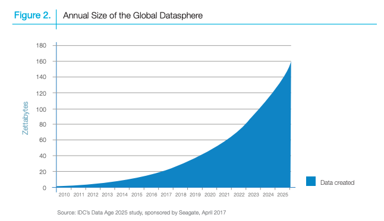

```{r setup, include=FALSE}
knitr::opts_chunk$set(echo = TRUE)
```

## Introduction

Once upon a time in Hollywood, it was adequate for statisticians, data analysts, physicians, ... to

a. pull up the Rstudio, 
b. `write.csv()` the file, 
c. for loop into the files and 
d. apply statistical analytics and draw inference from data and experiments. 

The world is expanding and so the programming languages and methods. The good methodology in the past could get very ugly nowadays without us noticing that. We need to understand the nature of the problem, data available, and types of studies and select the best tool to solve that.  

"The amount of data being generated and stored is growing exponentially", this is the phrase we keep hearing. The data/information explosion has brought a lot of challenges in processing large amount of data and made our "fun" process of data analysis into an "OK" daily task. If you feel the same, you are not alone and that is why I am writing this blog. We need to change our programming habbits to be able to "Make Data Analysis Great Again!". I will try my best to explain why, when, and how to apply parallel computing. Let's get back to the topic:




## Why & When

Following the cinematic schema of the blog, I would like to use movie data to illustrate how parallelization can be used to make our lives less dramatic. The dataset I am using here is downloaded from [CMU Movie Summary Corpus](http://www.cs.cmu.edu/~ark/personas/data/MovieSummaries.tar.gz). For more information about the dataset please visit the page. The plot summary of the movies are stored in `plto_summaries.txt` file. I have only using the first 1000 summaries from that file:

```{r movies}
sample = read.csv('../sample_plot_summmary.csv')
print(sample[1, 2])
```

### Why parallel computing?

```{r cars}

```

### When to Parallelize?


## Parallel packages in R