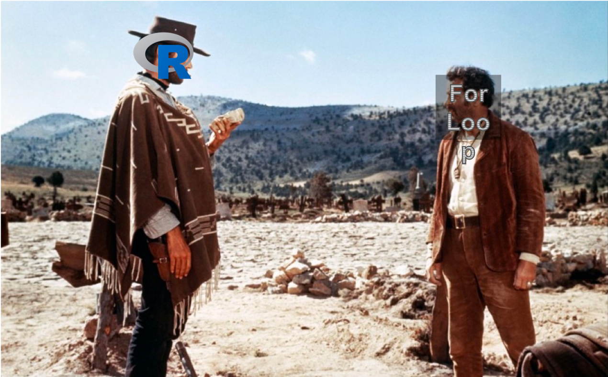

```{r setup, include=FALSE, echo=FALSE}
knitr::opts_chunk$set(echo = TRUE)
library(ggplot2)
library(doParallel)
library(foreach)
library(reshape2)
num_cores <- parallel::detectCores() 
registerDoParallel(num_cores)
```

## Introduction

Once upon a time in Hollywood, it was adequate for statisticians, data analysts, physicians, ... to

a. pull up the Rstudio, 
b. `read.csv()` the file, 
c. for loop into the files and 
d. apply statistical analytics and draw inference from data and experiments. 

Since then, the universe has been expanding and so the programming languages and methods. With great power comes great responsibilities (challanges) though. The good methodology in the past is getting really ugly nowadays without us noticing that. Thus, for us (as reasearchers, data enthusiasts, scientists, ...) there is modern need to understand the nature of the problem, the quality/size of the data in hand, philosophy, pros and cons of different methods. Well, the end goal is to select the best tool to solve those problems, also never forget *Correlation does not ALWAYS imply causations, though sometimes it does*. I am writing this blog trying to change our programming habbits with the hope "Make Data Analysis Great Again!". I will try my best to explain why, when, and how to apply parallel computing





## Why & When

Following the cinematic schema of the blog, I would like to use movie data to illustrate how parallelization can be usefull to make our lives less dramatic. The dataset I am using here is downloaded from [CMU Movie Summary Corpus](http://www.cs.cmu.edu/~ark/personas/data/MovieSummaries.tar.gz). For more information about the dataset please visit the page. The plot summary of the movies are stored in `plto_summaries.txt` file. Let's take a look at the first two lines of the table:

```{r movies}
# plot_summary = read.csv('../sample_plot_summmary.csv')
plot_summary <- read.table('../data/plot_summaries.txt', sep = '\t')
plot_summary <- data.table::fread('../data/plot_summaries.txt', header = FALSE)
row_number <- seq(100, nrow(plot_summary), by= 100)
knitr::kable(head(plot_summary, n=2L)) 
```

As the table above shows, the table includes the movie id and plot summary. Using some imagination and crativity, there are lots of cool things we can do from those plot summaries, such as finding the movies with similar subjects, categorizing the movies (re-inventing the wheel!! not so great), training a model to create new plots. Well, that might be interesting to see a movie that is written by an AI model. However, for all those cool stuffs, we need to read in the data rows and extract some features out of them. For simplicity, let's suppose I naively think **world war** and **Johannesburg** are THE two keywords going to help my model with clustering the movies, and the other feature is number of words in the summary plot!! (well I assume this was the techniques during pre-deep learning era to "extracct" features from text). I write those down as a *text_features* function below:

```{r function}
text_features <- function(text){
  words_to_search <- c('johannesburg', 'world war')
  reg_word <- paste0(words_to_search, collapse = '|')
  word_exists <- grepl(reg_word, tolower(text))
  word_count <- sapply(strsplit(tolower(text), " "), length)
  return(c(word_exists, word_count))
}
```

```{r ugly}
single_loop_script <- function(sample) {
    for (i in 1:nrow(sample))
      sample[i, c('keyword', 'word_counts')] <- text_features(sample[i, 2])
    return(sample)
}
``` 

```{r bad}
mapply_script <- function(sample) {
  sample[, c('keyword', 'word_count')] <- mapply(text_features, sample[, 2])
  return(sample)
}

``` 


```{r good}
parallel_loop_script <- function(sample) {
    registerDoParallel(num_cores)
    extracts <- foreach (i = 1:nrow(sample), .combine = rbind) %dopar%
      text_features(sample[i, 2])
    #Change the list to dataframes
    # extract_df <- do.call(rbind.data.frame, extracts)
    return(as.data.frame(extracts))
  }
``` 

```{r timeline}

# If foreach is better let's change the behavior and use it while we can
runtime_list <- foreach (i = 1:length(row_number)) %dopar%
{
  for_single <- system.time(single_loop_script(plot_summary[1:row_number[i],]))
  mapply_method <- system.time(mapply_script(plot_summary[1:row_number[i],]))
  for_parrallel <- system.time(parallel_loop_script(plot_summary[1:row_number[i],]))
  return(list(i, for_single[[3]], mapply_method[[3]], for_parrallel[[3]]))
}
```


### Why parallel computing?

```{r visualization}
# change the list of lists to dataframe
runtime_df <- do.call(rbind.data.frame, runtime_list)
names(runtime_df) <- c('index', 'single_loop', 'mapply', 'parallel_loop')

# need to melt the dataframe to be able to line plot them
melted <- reshape2::melt(runtime_df, measure.vars = c('single_loop', 'mapply', 'parallel_loop'))
ggplot(melted, aes(index, value, color = variable)) +
  geom_line(aes(group = paste0(variable)))
# x <- 1:length(run_time1)
# plot(x, run_time1, type = 'l', col = 'blue')
# lines(x, run_time2, type = 'l', col = 'red')
# lines(x, run_time3, type = 'l', col = 'green')
# legend(x=1.5, y=1.5, legend=c("for", "mapply", 'dopar'), col = c('blue', 'red', 'green'), lty=1)

```

### When to Parallelize?


## Parallel packages in R